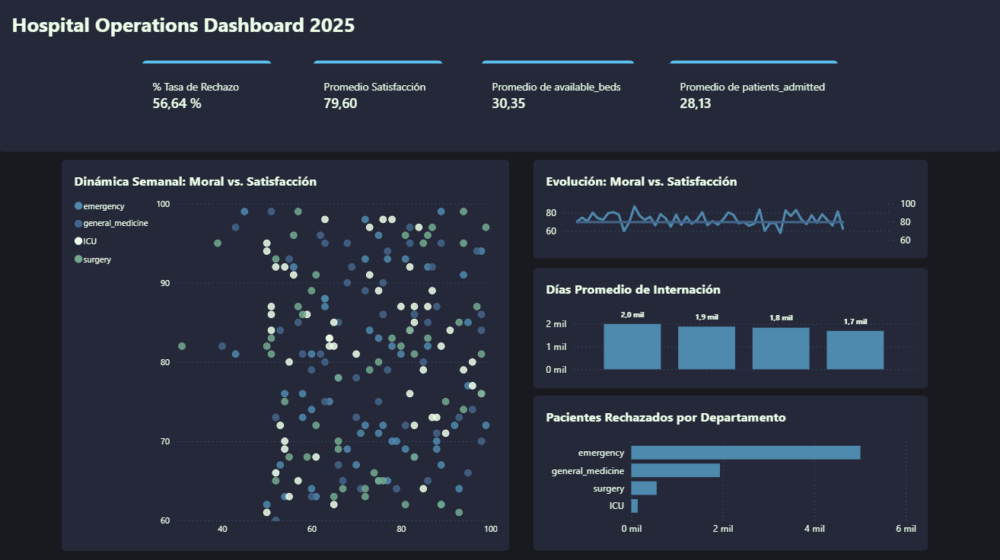

#  🏥 Hospital Operations & Patient Experience Analysis (2025)



*(Vista previa del Dashboard Ejecutivo)*

## 📌 Resumen del Proyecto
Este proyecto es un ejercicio **"Full Stack Data Analyst"** que simula el ciclo de vida completo de los datos para una red hospitalaria. 

El objetivo principal fue diagnosticar las causas de la saturación en servicios críticos y validar estadísticamente la relación entre el bienestar del personal (*Staff Morale*) y la calidad de atención percibida por el paciente (*CSAT*).

**Pregunta de Negocio:** ¿Cómo impactan los cuellos de botella operativos y la moral del equipo en la experiencia del paciente?

---

## 🛠️ Tech Stack & Flujo de Trabajo

Este proyecto integra 4 herramientas clave para demostrar versatilidad técnica y de negocio:

### 1. SQL Server (Ingeniería de Datos & ETL)
* **Motor:** Microsoft SQL Server Management Studio (SSMS).
* **Modelado:** Diseño de esquema relacional (`Primary Keys`, `Foreign Keys`).
* **ETL & Limpieza de Datos (El Desafío):** * *Problema:* Los datasets crudos presentaban inconsistencias graves; los IDs de los empleados en la tabla de horarios no coincidían con la tabla maestra de personal.
    * *Solución:* Desarrollé un script de migración utilizando `INNER JOIN` basado en **nombres** y funciones de limpieza (`TRIM`) para reconstruir la integridad referencial y recuperar miles de registros que de otro modo se habrían perdido.
* **Análisis:** Uso de `Window Functions` (`RANK`, `PARTITION BY`) para clasificar el rendimiento semanal por servicio.

### 2. Python (Ciencia de Datos & Estadística)
* **Librerías:** Pandas, Seaborn, Matplotlib.
* **Feature Engineering:** Cálculo de nuevas métricas como *Length of Stay* (Días de Estancia) restando fechas de admisión y alta.
* **Validación Estadística:** Generación de una Matriz de Correlación (Heatmap) que reveló patrones ocultos entre la ocupación de camas y la satisfacción.

### 3. Power BI (Business Intelligence)
* **Dashboard:** "Hospital Operations Dashboard 2025".
* **Diseño:** Interfaz limpia orientada a la toma de decisiones con navegación por KPIs.
* **Storytelling:** Gráfico de "Dinámica Semanal" que visualiza cómo la caída en la moral del equipo precede a las caídas en la satisfacción del cliente.

### 4. Excel (Herramientas de Gestión)
* **Reporte Corporativo:** Tablas dinámicas para el conteo de *headcount* y roles.
* **Buscador Interactivo:** Desarrollo de una herramienta interna con `BUSCARV` (VLOOKUP) y Validación de Datos, permitiendo a RRHH consultar fichas de empleados mediante una interfaz "App-like" sin líneas de cuadrícula.

---

## 📊 Hallazgos Clave (Key Insights)

1.  **El Factor Humano es Crítico:** El análisis en Python y Power BI confirmó una **correlación positiva fuerte (0.75)** entre la moral del personal y la satisfacción del paciente.
    * *Recomendación:* Invertir en el bienestar del personal tiene un retorno directo en la calidad del servicio.
2.  **Cuello de Botella en Medicina General:** Este servicio presenta una **tasa de rechazo >80%** durante la temporada de gripe (*Flu Season*), mientras que Cirugía mantiene capacidad ociosa.
    * *Recomendación:* Implementar un sistema de camas flexibles para derivar pacientes de Medicina General a alas de Cirugía en semanas críticas.
3.  **Eficiencia Operativa:** La UCI (*ICU*) demostró ser el servicio más consistente en tiempos de estancia, mientras que Emergencias presenta la mayor variabilidad y riesgo de saturación.

---

## 📂 Estructura del Repositorio

```text
Hospital_Data_Analysis/
├── data/                  # Datasets originales (CSV)
├── excel/                 # Reporte de Staff & Buscador Interactivo
├── powerbi/               # Dashboard (.pbix)
├── python/                # Notebook de Análisis (EDA) & Gráficos
├── sql/                   # Scripts SQL (Schema, ETL, Queries)
├── dashboard_preview.png  # Vista previa del Dashboard
└── README.md              # Documentación del proyecto
